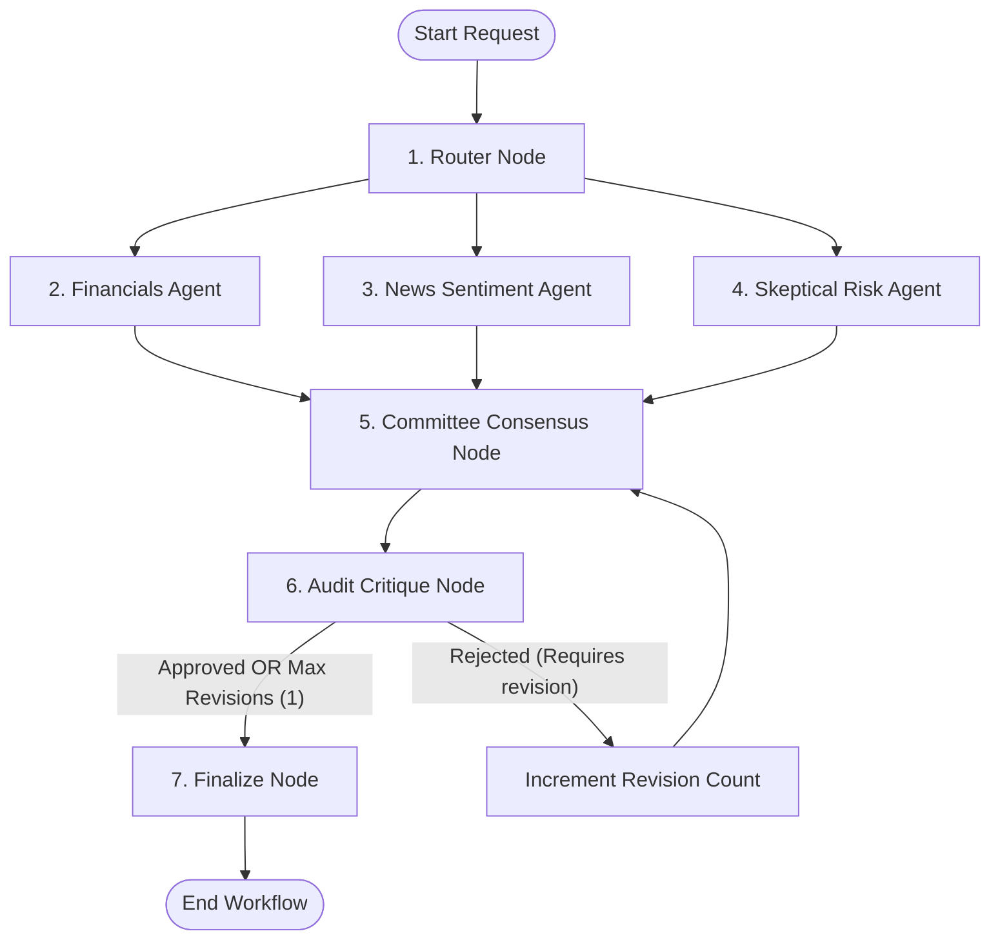

# AI Investment Research Agent

> Full-stack, LangGraph-orchestrated multi-agent consensus network designed to produce institutional-grade financial analysis and investment recommendations.

Live Production URL: [https://ai-investment-agent-rouge.vercel.app](https://ai-investment-agent-rouge.vercel.app)  
GitHub Repository: [https://github.com/shriyam052003/ai-investment-agent](https://github.com/shriyam052003/ai-investment-agent)  
Chat Transcript/Logs: [`chat_transcript.md`](file:///c:/Users/Hp/OneDrive/Desktop/new%20Assigment/ai-investment-agent/chat_transcript.md)

---

## 📋 Overview
The AI Investment Research Agent is an intelligent system that models a professional investment committee. Instead of relying on a single prompt or agent to make complex financial decisions, this system uses multiple specialized agents that retrieve real-time financial metrics, analyze current news sentiments, identify potential risks, and debate their findings. 

---

## 🛠 How It Works (Approach & Architecture)

The system is built on **LangGraph.js**, which enables cyclic and parallel graph orchestration:



### 1. The Nodes & Specialized Agents:
* **Router Agent ([router.ts](file:///c:/Users/Hp/OneDrive/Desktop/new%20Assigment/ai-investment-agent/src/lib/agents/router.ts))**: 
  Resolves the user's natural query into a valid stock ticker symbol (e.g., "Tesla" -> `TSLA`) and extracts sector/exchange metadata.
* **Financials Agent ([financials.ts](file:///c:/Users/Hp/OneDrive/Desktop/new%20Assigment/ai-investment-agent/src/lib/agents/financials.ts))**: 
  Retrieves quarterly earnings, P/E ratios, profit margins, and balance sheet health using the Alpha Vantage API.
* **News Agent ([news.ts](file:///c:/Users/Hp/OneDrive/Desktop/new%20Assigment/ai-investment-agent/src/lib/agents/news.ts))**: 
  Searches Google/web sources using Tavily for recent press releases, market trends, and public sentiment.
* **Skeptical Risk Agent ([risk.ts](file:///c:/Users/Hp/OneDrive/Desktop/new%20Assigment/ai-investment-agent/src/lib/agents/risk.ts))**: 
  Acts as a short-seller/bear, researching legal disputes, competition, macroeconomic headwinds, and governance red flags.
* **Consensus Committee ([committee.ts](file:///c:/Users/Hp/OneDrive/Desktop/new%20Assigment/ai-investment-agent/src/lib/agents/committee.ts))**: 
  Synthesizes reports from the three agents. Debates buy/sell/hold ratings, assigns confidence levels, and sets a target price.
* **Audit Critique Partner ([critique.ts](file:///c:/Users/Hp/OneDrive/Desktop/new%20Assigment/ai-investment-agent/src/lib/agents/critique.ts))**: 
  Independently reviews the committee's decision, searching for bias or unjustified assumptions, sending it back for revision if necessary.

---

## ⚡ Setup & Installation (How to Run)

### Prerequisites
Make sure you have [Node.js (v18+)](https://nodejs.org/) installed.

### 1. Clone the Project
```bash
git clone https://github.com/shriyam052003/ai-investment-agent.git
cd ai-investment-agent
```

### 2. Install Dependencies
```bash
npm install
```

### 3. Configure Environment Variables
Create a `.env.local` file in the root of the project:
```ini
# Google Gemini API Key
GEMINI_API_KEY=your_gemini_api_key

# Tavily Search API Key
TAVILY_API_KEY=your_tavily_api_key

# Alpha Vantage API Key
ALPHA_VANTAGE_API_KEY=your_alpha_vantage_api_key
```

### 4. Run Locally
```bash
npm run dev
```
Open [http://localhost:3000](http://localhost:3000) to view the application.

---

## 💡 Key Decisions & Trade-Offs

### 🟢 Next.js Unified Frontend & Backend
* **Decision**: We built a single Next.js Next-Gen application using React for the interface and Next.js Route Handlers for the LangGraph agent backend.
* **Trade-off**: While separating the API to Python is standard for AI projects, keeping the stack entirely in TypeScript simplifies state serialization, speed of development, and deployment orchestration on Vercel.

### 🟢 Strict Rate Limit Serialization
* **Decision**: Enforced an intentional **12-second delay** between API requests to Alpha Vantage.
* **Trade-off**: This increases the total run time of the analysis pipeline. However, it prevents rate limit errors (5 calls/min limit on Alpha Vantage free tier), ensuring 100% data reliability.

### 🟢 Corrective Schema Self-Correction
* **Decision**: Implemented a retry wrapper for LLM responses. If Zod schema validation fails, the error is fed back into Gemini for auto-correction.
* **Trade-off**: Adds token cost and latency if a retry occurs, but guarantees structured JSON data and prevents pipeline runtime failures.

---

## 📊 Example Runs

### Case 1: Tesla (TSLA)
* **Status**: Successful
* **Consensus Verdict**: **HOLD** (Confidence: `0.75`)
* **Rationale**: Strong balance sheet and EV market leader position, but high valuation multiples (high P/E ratio) and short-term margin pressure from vehicle price cuts.

### Case 2: Nvidia (NVDA)
* **Status**: Successful
* **Consensus Verdict**: **BUY** (Confidence: `0.88`)
* **Rationale**: Astronomical revenue growth driven by AI data center compute dominance. High multiples are justified by industry-wide supply deficit and high pricing power.

---

## 🚀 What We Would Improve With More Time

1. **Caching / DB Integration**: Implement Redis or MongoDB to cache Alpha Vantage financials and Tavily news for 24 hours to reduce external API dependency.
2. **WebSockets/Streaming Responses**: Stream tokens and real-time step execution events to the frontend via Server-Sent Events (SSE) or WebSockets instead of waiting for the full pipeline completion.
3. **Interactive Charts**: Render charts showing historical revenue, profit margins, and stock price trends.

---

## 📁 Submission Packages & Chat Transcripts
* **Main Project Files**: Next.js source code is located in `/src`.
* **Bonus Chat Transcript**: Find the complete developer-AI chat logs in [chat_transcript.md](file:///c:/Users/Hp/OneDrive/Desktop/new%20Assigment/ai-investment-agent/chat_transcript.md).
